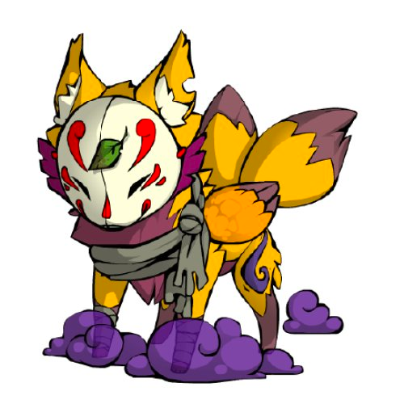

<!-- headingDivider: 1 -->

 
# Todoアプリハンズオン 
## by Flutter

pregum
 
# 目次

* 最初に
* Flutterとは？
* Flutterとネイティブアプリとの違い
* なぜ他のXPではなくFlutterなのか？:thinking:
* 今日作るアプリについて
* TodoApp作成
* (時間があれば)、質疑応答

---
### 最初に

今日はハンズオンに参加していただき、ありがとうございます。

1点お願いがあります。
サンプルのカウンターアプリが起動ができていない方は
話している最初の10~15分程度でサンプルのカウンターアプリの起動まで準備していただけますと
スムーズに進行できるかと思いますので、ご協力お願いします。

それではよろしくお願いします。

---
### 動作環境

Flutterのバージョン: 3.0.5

Flutterのバージョンは`flutter doctor -v`で確認できます。

Flutterのバージョンをいじりたくない場合は
`fvm`を入れてバージョンを固定しましょう.

`brew install fvm` コマンド実行後、今回の作業フォルダで`fvm local 3.0.5 -f`を実行すればOK

参考サイト: https://zenn.dev/riscait/articles/flutter-version-management

---
### 自己紹介

1995年生まれ

普段はKotlin, Swift, TypeScript で開発しています

Flutterで個人アプリを
作っています

# Flutterとは？

* Googleが開発中のクロスプラットフォーム(以降XP)開発が可能なフレームワークです。
* 今現在(2022/8/22)、iOS/Android/Web/Linux/macOS/Windowが開発可能です。

---
## Flutterとネイティブアプリとの違い 

開発スピードと処理速度

項目|Flutter|ネイティブアプリ
:---:|:---:|:---:
パフォーマンス | 若干遅い | 早い
開発速度 | 概ね１Platform分 | OS数に応じて遅くなる
検討されるケース | 開発コスト削減 | nativeの機能が必要 

---
## なぜ他のXPではなくFlutterなのか？:thinking:

色々ありますが以下が大きな要因です。

<ul>
  <li>いい感じのUIが標準ライブラリで作れる</li>
  <li>アプリを起動しながらレイアウトの微調整が可能</li>
  <li>Debugツールが使いやすい</li>
</ul>

---
## 今日作るアプリについて
#### 今日できるアプリ

https://github.com/Pregum/chat-app-hands-on-flutter

機能一覧

* チャット送信機能
* メッセージ受信機能
* 

---
## アプリを作り始める前に

#### FlutterのUIについて

FlutterのUIは全て**ウィジェット**

* テキスト
* ボタン
* チェックボックス
* etc...

---
### FlutterのUIについて
ウィジェットは大きく分けて2種類存在する

* **状態(State)を持つStateful Widget**
  * setState()で状態を変更可能
* **状態(State)を持たないStateless Widget**
  * setState()は使用不可
  * 親ウィジェットや外部から受け取るデータによって更新可能

最初はStateful Widgetを使っておけばOK:+1:

---
### Flutterは宣言的UI

  

  ###### 宣言的UI (React, SwiftUI, etc...)

    String name = 'taro';

    Center(
      child: Text('Hello $name'),
    ),

    // -> Hello taro

  何を表示させるかを記述する。
  

  

  

  

  ###### 命令的UI (UIKit, WinForms, etc...)

    text.frame = CGRect(
      x: 50,
      y: 50,
      width: 50,
      height: 50
    )
    text.text = "taro"
    text.textAlignment = NSTextAlignment.Center

  レイアウトの配置からテキストの文字列まで記述する。
    
  

---
### 一言で表すと

宣言的UIは**何をしたいかをコードで伝える** (What)

命令的UIは**どのようにしたいかをコードで伝える** (How)

---
## Todoアプリで使う主なウィジェット

* **Column**
  * 縦並びでウィジェットを配置してくれるウィジェット

* **SingleChildScrollView**
  * スクロールする画面を作ってくれるウィジェット

---
## 作成の流れ

1. Firebaseのプロジェクト作成
2. 実際に書き込んでみる。
3. よくあるチャットUIを作成する。

---

## プロジェクトのクローン

下記コマンドを叩いて
テンプレートのプロジェクトをローカルにクローンします。

`
git clone git@github.com:Pregum/chat-app-hands-on-flutter.git
`

---

## step1. Firebaseに接続しよう

cloneしたプロジェクトに既にプロジェクトに接続されているため、今回はそのプロジェクトを使用します。

自分でプロジェクト入れる場合は、下記サイトに沿って入れてみてください。
https://firebase.google.com/docs/flutter/setup?platform=android

---

## step2. 

---
## 完成 :tada: :christmas_tree: :dart: :beer:

## :confetti_ball: お疲れ様でした :confetti_ball: 

---
## 改善ヒント

* 少しずつデータを読み込む仕組みを作る
* 日付が変わった箇所で日にちを表示するウィジェットを入れてみる
* 動画や画像を送信できるようにしてみる

---
## 参考サイト

* https://twitter.com/gethackteam/status/1268892357027663873?ref_src=twsrc%5Etfw%7Ctwcamp%5Etweetembed%7Ctwterm%5E1268892357027663873%7Ctwgr%5E12007820d2fc3fecbe0ca6381183ab580763b432%7Ctwcon%5Es1_&ref_url=https%3A%2F%2Fqiita.com%2FHiroyuki_OSAKI%2Fitems%2Ff3f88ae535550e95389d

* https://qiita.com/Hiroyuki_OSAKI/items/f3f88ae535550e95389d

* https://ui.dev/imperative-vs-declarative-programming
